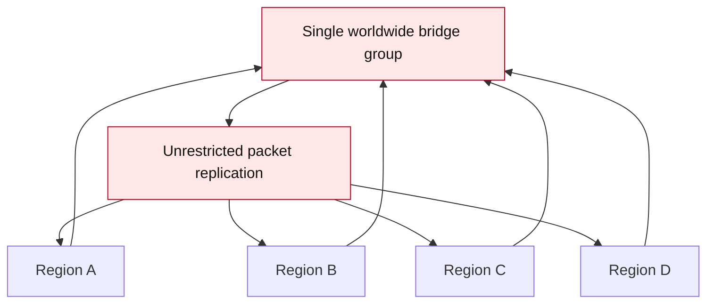

## MeshCoreNG

Translations: [Nederlands](./README-NL.md) | [Deutsch](./README-DE.md)

MeshCoreNG is a Next Gen variant of MeshCore.

In simple terms: MeshCore lets LoRa devices pass messages to each other without the internet. MeshCoreNG builds on that and focuses on making repeaters smarter, so larger and busier networks can keep working better.

MeshCore now supports a range of LoRa devices, allowing for easy flashing without the need to compile firmware manually. Users can flash a pre-built binary using tools like Adafruit ESPTool and interact with the network through a serial console.
MeshCore provides the ability to create wireless mesh networks, similar to Meshtastic and Reticulum but with a focus on lightweight multi-hop packet routing for embedded projects. Unlike Meshtastic, which is tailored for casual LoRa communication, or Reticulum, which offers advanced networking, MeshCore balances simplicity with scalability, making it ideal for custom embedded solutions, where devices (nodes) can communicate over long distances by relaying messages through intermediate nodes. This is especially useful in off-grid, emergency, or tactical situations where traditional communication infrastructure is unavailable.

Website and web flasher: https://michtronics.github.io/MeshCoreNG/

The goal is not to rebuild MeshCore from scratch. The goal is to add improvements step by step, without breaking existing clients or the existing protocol.

## Why This Matters In The Netherlands

MeshCoreNG is being developed from the Netherlands. This is exactly the kind of place where dense-mesh firmware problems show up quickly.

The Netherlands is small, densely populated, and busy. In cities and towns, many LoRa nodes and repeaters may be able to hear each other at the same time. That sounds useful, but in a flood mesh it can also mean that too many repeaters retransmit the same message. The channel fills up faster.

On top of that, we use EU868 with airtime and duty-cycle limits. Every unnecessary retransmission therefore costs real capacity. In a quiet rural area you want maximum propagation, but in a Dutch city you mainly want to prevent the network from shouting over itself.

MeshCoreNG is trying to solve exactly that problem: stay reliable in quiet areas, but become calmer and smarter in busy Dutch meshes.

## What Are We Trying To Achieve?

MeshCore works well as a simple flood mesh network: repeaters pass messages further through the network. That is strong and reliable, especially in small or quiet networks.

But in a busy network, flooding can also create too much radio traffic. Many repeaters may retransmit the same message again. That costs airtime, increases the chance of collisions, and can make the network slower.

MeshCoreNG aims to improve this:

- Fewer unnecessary retransmissions.
- Less load on the LoRa channel.
- Repeaters that can better measure what is happening.
- Dense city meshes that stay more stable.
- Sparse rural meshes that still propagate reliably.
- Better bridge options for controlled RF islands.
- Easier browser flashing and firmware downloads.
- Region-aware tools for larger deployments.
- A telemetry foundation for future maps, dashboards and observers.
- No breakage for existing MeshCore clients.

## Device Reliability Updates

MeshCoreNG also includes a generic low-battery boot guard for battery-powered boards. Directly after `board.begin()`, firmware reads the board battery voltage. If the reading is valid but too low, the node sleeps and retries instead of starting radio, display, GPS, sensors or bridge code. This helps boards recover after a deeply discharged battery is connected to a charger.

Default behavior:

- below `2500mV`: treat as invalid or unsupported battery reading
- `2500mV` to `3299mV`: sleep and retry
- `3300mV` or higher: continue normal boot

Repeater, GPS tracker / sensor, and room server builds can tune this from the CLI with `set boot.lowbat.guard`, `set boot.lowbat.mv`, `set boot.lowbat.valid_min`, and `set boot.lowbat.retry`. The defaults can also be tuned per build with `LOW_BAT_BOOT_GUARD_MV`, `LOW_BAT_BOOT_VALID_MIN_MV` and `LOW_BAT_BOOT_RETRY_SECS`.

Repeater, GPS tracker / sensor, and room server builds also include a runtime low-battery guard. While the node is running, it periodically checks battery voltage. If the node is not externally powered and the battery falls below the runtime threshold, it sleeps before WiFi, bridge, GPS, display or radio work can drain the battery further. Tune it with `set runtime.lowbat.guard`, `set runtime.lowbat.mv`, `set runtime.lowbat.valid_min`, and `set runtime.lowbat.retry`. See [docs/battery_boot_guard.md](./docs/battery_boot_guard.md).

GPS tracker variants with a display now keep the display on and show tracker-specific information such as GPS fix state, satellite count, position or waiting status, TX interval and battery voltage. Tracker reports are sent as Trackers-channel group datagrams for older repeater compatibility, include speed and heading where the GPS provider exposes them, and the TCP bridge map can show the reported route history. See [docs/location_tracker.md](./docs/location_tracker.md).

## What Have We Done So Far?

We have added the first real dense-mesh foundation to the repeater firmware.

### 1. Less flood advert noise

Flood adverts are network advertisements that can be spread through repeaters. In a busy network they can use a lot of airtime.

That is why MeshCoreNG now has:

- `flood.advert.base`
- default value `0.308`

Simple explanation:

- `0` means: do not forward received flood adverts.
- `0.308` means: dense mesh default, less forwarding as hop count grows.
- `1` means: forward everything as normal.

This mainly helps in busy repeater networks where many nodes can already hear each other.

### 2. Dense stats

We can now better see what a repeater is doing.

With:

```text
get dense.stats
```

you can see things like:

- how many flood adverts were received
- how many flood adverts were forwarded
- how many flood adverts were dropped
- how many duplicate flood packets were seen
- how much RX/TX airtime is roughly being used
- how many CAD/channel-busy events occurred
- density level
- congestion level

With:

```text
clear dense.stats
```

you reset these counters. The stats are RAM-only and also disappear after reboot.

### 3. Manual relay probability

We added an extra knob:

```text
get flood.relay.prob
set flood.relay.prob <0..255>
```

Simple explanation:

- `0` means: do not relay flood packets.
- `128` means: relay about half of them.
- `255` means: normally relay everything that is allowed.

The default is `255`, so existing networks keep working the same way.

### 4. Dynamic mode preparation

There is also:

```text
get flood.dynamic.enable
set flood.dynamic.enable on
set flood.dynamic.enable off
```

Important: in this version, dynamic mode does not automatically change behavior yet.

For now, it is mostly preparation and observation. We want to collect real data from real networks before letting the firmware make automatic decisions.

Dynamic mode is off by default.

### 5. Better channel-busy detection

The repeater now uses hardware CAD/channel scan where possible. That lets the firmware better detect whether the channel is busy before it transmits.

This helps reduce collisions and unnecessary transmissions on a busy LoRa channel.

### 6. Node-based retransmit spreading

Dense repeater groups can still line up too neatly: several repeaters may receive the same packet at the same time, make the same `txdelay` decision, and start retransmitting almost together. MeshCoreNG now adds a very small deterministic per-node offset on top of the existing random retransmit delay for flood traffic.

The flood retransmit delay is now:

```text
random txdelay spread + stable node offset
```

The stable offset is derived from the node identity already stored in the firmware. It is stable across reboot, creates no extra packets, does not change the protocol or packet format, and is only used for flood retransmit scheduling. If `txdelay` is set to `0`, the offset is not added, so old zero-delay behavior stays available. You can also disable only the stable offset with `set flood.node.delay off`.

This is different from CAD retry timing:

- `txdelay` spreads repeaters before a flood packet enters the TX queue.
- The node offset prevents repeaters from becoming phase-locked with each other.
- CAD retry happens later, after the radio detects that the channel is busy. The current CAD retry window is 120-360 ms.

Practical tuning:

| Repeater role | Suggested behavior |
|---|---|
| Local / low-site repeater | Lower `txdelay` can keep the local mesh responsive. |
| High-site / backbone repeater | Higher `txdelay` gives nearby repeaters a chance to handle local traffic first. |
| Very dense city group | Keep `txdelay` enabled so random spread plus node offset reduces synchronized retransmits. |

### 7. Duplicate-hearing retransmit suppression

Dense meshes also benefit from cancelling work that is no longer needed. When a repeater schedules a flood retransmit and then hears enough other repeaters forwarding the same packet before its own timer expires, MeshCoreNG can suppress its pending retransmit.

Simple example:

```text
hear new flood packet
schedule retransmit
hear two duplicate forwards of the same packet
cancel local retransmit
```

The default threshold is conservative: two duplicate forwards must be heard before cancellation. If no duplicates are heard, the retransmit still happens normally, so sparse networks keep their reach. Locally generated packets, direct routing, ACKs, path/control packets and trace/control traffic are not suppressed. You can disable this behavior with `set flood.dup.suppress off`.

This reduces duplicate flooding, airtime waste and collision probability without extra packets, without synchronization, and without changing the protocol.

### 8. Internet bridge — optional transport for isolated RF deployments

#### Purpose of the bridge system

MeshCoreNG is RF-first. The bridge system is optional transport/backhaul for specific deployments, not a replacement for RF-local operation.

Bridges are intended for:
- linking isolated geographic MeshCore RF regions that should intentionally exchange selected traffic
- remote RF gateways that need a controlled backhaul path
- temporary backhaul during events, tests, or outages
- observer, measurement, and research setups
- private infrastructure operated by a known group

Bridges are not intended for:
- a worldwide flooding backbone
- an always-on global relay
- unrestricted packet replication
- bypassing normal RF planning and segmentation

Selected traffic can optionally be transported between isolated MeshCore deployments. Bridge operators decide which bridge server, repeaters, regions, and traffic sources are appropriate for their network.

#### Intended usage


The bridge is a controlled link between selected RF islands. Each island should still be designed as a sensible local RF network.

#### Not intended



Large-scale uncontrolled forwarding is discouraged. It wastes RF airtime, makes loops harder to reason about, and works against MeshCoreNG's goal of keeping busy radio networks calm.

#### RF locality remains important

RF airtime efficiency remains a primary MeshCoreNG design goal. Internet transport should not be used to bypass sensible RF segmentation.

Operators should bridge only what is needed for the deployment. Keep local traffic local where possible, use regional segmentation, and avoid forwarding traffic into RF areas that do not need it.

#### Best practices

- Bridge only required channels, topics, or traffic sources.
- Avoid unnecessary rebroadcast into RF networks.
- Use regional segmentation for large deployments.
- Use private bridge groups or private bridge servers when possible.
- Avoid full-network flooding across bridge links.
- Monitor airtime, duplicate counters, and congestion after enabling a bridge.
- Treat every bridge as an operated network service with an owner and a purpose.

#### Loop and duplicate protections

Multi-bridge environments need additional safeguards because the same packet may be able to return through a different bridge path.

Implemented protections:
- TCP bridge v2 envelope with per-bridge origin ID and TTL (`set bridge.tcp.ttl`, default 2). The envelope is TCP-only metadata; RF flood packets exported to TCP also get the exporting bridge-repeater's node hash added to the MeshCore path when it is not already present.
- Stable bridge identity advertised in TCP caps metadata. By default it is derived from node/device identity; `set bridge.id <8-hex>` can pin it for hardware replacement or multi-interface deployments.
- Export filter (`set bridge.export`) and hop-count limit (`set bridge.export.maxhops`) to restrict which packets cross the bridge.

Planned or under consideration:
- path fingerprints
- lightweight path hashes
- bridge loop detection
- duplicate suppression
- bridge scoping

These mechanisms are intended to make controlled bridge deployments safer. They do not change the basic guidance: avoid uncontrolled forwarding, keep bridge groups scoped, and preserve RF locality.

The TCP bridge is a controlled backhaul, not a blind transparent internet mesh. It keeps MeshCore RF packets compatible, while the TCP boundary remains semi-transparent through TCP-only metadata, duplicate suppression, origin IDs, TTL, export filters, and RF injection controls.

#### Bridge FAQ

**Does MeshCoreNG require internet?**  
No. MeshCoreNG remains usable as an RF-only LoRa mesh.

**Is the bridge enabled by default?**  
No. Bridge support requires a bridge-capable firmware build and `set bridge.enabled on`.

**Is this intended to create a global internet mesh?**  
No. The bridge is for controlled transport between selected deployments, not worldwide packet propagation.

**Can bridges be private?**  
Yes. Private bridge servers and private bridge groups are recommended for many deployments.

**Are anti-loop protections planned?**  
Yes. Path fingerprints, lightweight path hashes, loop detection, duplicate suppression, TTL/hop controls, and bridge scoping are planned or being evaluated, especially for multi-bridge environments.

#### Path 1: ESP32 repeater with WiFi

Repeaters with WiFi can connect directly to a selected bridge server.

```text
set wifi.ssid     YourWiFi
set wifi.password secret123
set bridge.server yourserver.example.com
set bridge.port   4200
set bridge.password bridgeSecret
set bridge.enabled on
```

**Upgrade note:** MeshCoreNG keeps compatibility with the TCP bridge preferences used before the large merge from the original MeshCore v1.16.0 firmware. When upgrading from older MeshCoreNG bridge builds, saved WiFi and TCP bridge settings are migrated from the legacy layout automatically. If a node was already booted with a build that saved shifted/empty values, re-enter `wifi.ssid`, `wifi.password`, `bridge.server`, `bridge.port`, optionally `bridge.password`, and `bridge.enabled` once.

Bridge repeaters do not forward bridge-originated flood traffic onto LoRa RF by default. For controlled deployments that intentionally inject bridge traffic into the local RF mesh, enable:

```text
set bridge.rf on
```

For one-hop local RF injection of bridge-originated packets, use:

```text
set bridge.rf local
```

Bridge RF forwarding still uses the normal repeater forwarding path. Region rules, duplicate checks, loop detection, hop limits, relay probability, retransmit delay, and the normal RF TX queue still apply.

For controlled RF islands or backbone links, use the bridge export and profile controls instead of making the TCP bridge a real MeshCore route hop:

```text
set bridge.profile island    # RF island bridge: source both, RF local, messages up to 4 RF hops
set bridge.profile repeater  # controlled backhaul: source both, RF on, export all
get bridge.profile           # returns the last profile applied: default, island, or repeater
get bridge.export
get bridge.export.maxhops
get bridge.tcp.ttl
get bridge.id
```

TCP bridge v2 adds a small TCP-only envelope with origin and TTL metadata. When RF flood packets are exported to TCP, the exporting bridge-repeater adds its own node hash to the MeshCore path when it is not already present and the path still has room.

The Python TCP bridge server includes a status website on port `8080` by default. It shows online and recently seen bridge nodes, per-node RX/TX packet counts for the last 24 hours, heartbeat status, firmware version, bridge v1/v2 support, local RF neighbor count when reported by updated firmware, bridge-neighbor count from the server, and RF duty-cycle budget use. Disconnected nodes remain visible while they still have packet history inside the 24-hour window. The `Duty used` and `Duty left` values show the allowed hourly RF TX duty-cycle budget as timers: with a 10% duty-cycle setting, six minutes are available per hour, so `3m 00s` used means half of the hourly budget is gone.

Bridge nodes can also block a 1-byte source id locally through the server management page. This is a temporary runtime quarantine on the bridge/repeater itself: packets with the same byte are no longer retransmitted on RF, exported from RF to TCP, or injected from TCP to RF on that bridge. This intentionally blocks every packet with the same byte, even if another node collides with that byte:

```text
set node.block add a7 15m
set node.block del a7
get node.block
clear node.block
```

The server `/manage` page can send these `node.block` commands to one selected bridge node or all connected bridge nodes, the same way as path quarantine.

All 38 ESP32 repeater variants now have a `_bridge_tcp` firmware build available. See [docs/cli_commands.md](./docs/cli_commands.md) for the full command reference.

#### Bridge firmware types

MeshCoreNG has multiple bridge paths:

| Build type | Transport | Typical use |
| --- | --- | --- |
| `_bridge_tcp` | ESP32 WiFi TCP client | A WiFi-capable repeater connects directly to a controlled bridge server. |
| `_bridge_tcp_ble` | ESP32 WiFi TCP client + BLE UART bridge | Selected 8MB/16MB ESP32 WiFi+BLE repeaters can run TCP and BLE bridge transports in one firmware. |
| `_bridge_rs232` | Serial/UART bridge | Boards without WiFi use a PC/Raspberry Pi host script or a direct wired UART link to another repeater. |
| `_bridge_espnow` | ESP-NOW | Local ESP32 bridge experiments where WiFi infrastructure is not the main transport. |
| `_bridge_ble` | BLE UART bridge | nRF52 and ESP32 BLE repeaters can form a short-range bridge without WiFi, USB, or extra UART wiring. |

Use `get bridge.type` to confirm which bridge mode is compiled into the firmware. Some bridge builds also expose `get bridge.status`, `get node.info`, and a small HTTP status page where supported. The Python TCP bridge server status page shows connected nodes (including their node name, firmware version, full 32-byte public key, local RF neighbor count when reported by updated firmware, and bridge-neighbor count from the server), recent packet type/route/hop logs, encrypted peer/DM metadata, sensor adverts, tracker locations, and JSON endpoints such as `/status.json`, `/packets.json`, `/sensors.json`, and `/locations.json`. The server rate-limits excessive DM/group/transport packets before bridge broadcast, based on TCP client and packet category rather than node name or advertised identity. The tracker map at `/map` shows the latest tracker position, speed, heading and persisted route history for each tracker. IP addresses and connection details are redacted from data exposed on the public status page.

The BLE bridge is available for nRF52 BLE variants with Bluefruit and ESP32 variants with BLE support. It runs central and peripheral mode at the same time so either repeater can initiate the BLE link. Flash the same `_bridge_ble` firmware on both repeaters, set the same `bridge.secret` on both sides when you want to isolate a private bridge pair, then enable the bridge with `set bridge.enabled on`. Combined `_bridge_tcp_ble` builds are provided for ESP32 boards with enough flash; 4MB ESP32 boards are left as board-by-board test candidates because TCP+BLE can be tight there.

#### Path 2: Repeater via USB or direct UART

Some repeaters have no WiFi, including nRF52 boards (RAK4631), RP2040 boards, STM32 boards, and ESP32 boards in locations without WiFi coverage. These can use a USB-connected PC or Raspberry Pi as the bridge transport host.

The repeater runs standard `_bridge_rs232` firmware and sends bridge traffic over the serial port. A small Python script on the connected computer handles the TCP connection to the selected bridge server.

```text
[LoRa RF deployment]  <-->  [Repeater + RS232 bridge]  <--USB-->  [PC/RPi + usb_bridge_client.py]  <-->  [bridge server]
```

Set up on the repeater (RS232 bridge firmware):

```text
set bridge.enabled on
```

Run the relay script on the PC or Raspberry Pi:

```bash
pip install pyserial
python3 tools/usb_bridge_client.py --serial /dev/ttyUSB0 --baud 115200 \
                                    --server yourserver.example.com --port 4200 \
                                    --bridge-password bridgeSecret
```

On Windows, use `--serial COM3` instead of `/dev/ttyUSB0`. The script is included in this repository at [tools/usb_bridge_client.py](./tools/usb_bridge_client.py).

The same `_bridge_rs232` firmware can also be used as a direct wired UART bridge between two repeaters, without WiFi and without a USB host:

```text
Repeater A TX  -> Repeater B RX
Repeater A RX  -> Repeater B TX
Repeater A GND -> Repeater B GND
```

Use 3.3V TTL UART levels. Do not connect true +/-12V RS232 directly to the board pins.

For Seeed SenseCAP Solar, the RS232 bridge build uses `Serial1` on `D6`/`D7`:

```text
D6 = TX = GNSS_TX
D7 = RX = GNSS_RX
```

Connect SenseCAP Solar repeaters as `D6/TX -> D7/RX`, `D7/RX -> D6/TX`, and `GND -> GND`. These pins are shared with the GNSS UART, so do not expect GNSS/GPS to use that UART at the same time.

**Start the bridge server** (VPS, Raspberry Pi, or any internet-connected PC):

```bash
python3 tools/tcp_bridge_server.py --port 4200
# optional access password:
python3 tools/tcp_bridge_server.py --port 4200 --password bridgeSecret
```

The server script is included in this repository at [tools/tcp_bridge_server.py](./tools/tcp_bridge_server.py). It requires Python 3.10+ and has no external dependencies for basic bridge operation; optional public-channel decoding needs `cryptography`. WiFi repeaters and USB repeaters can connect to the same controlled bridge server simultaneously.

#### Channel decryption on the bridge server

The bridge server can decrypt selected MeshCore group channels in its status page and packet log. The standard `Public` and MeshCoreNG `Trackers` channels are known by default; the `Trackers` channel is used for compact GPS tracker reports. This is useful for server operators who want to inspect traffic passing through the bridge without running a separate client.

Supply a JSON file to add more channel names and secrets:

```bash
TCP_BRIDGE_PUBLIC_CHANNELS_FILE=tools/public_channels.json tools/tcp_bridge_server_ctl.sh start
# or pass the flag directly:
python3 tools/tcp_bridge_server.py --port 4200 --public-channels-file tools/public_channels.json
```

The included `tools/public_channels.json` contains public channels scraped from MeshWiki. To refresh it from the live MeshWiki page, run:

```bash
python3 tools/update_public_channels.py
```

This writes a fresh `tools/public_channels.json`. Restart the server to pick up the updated list. The file format is a JSON object with a `channels` array; each entry has a `name` and a `secret` (32 or 64 hex characters). Channels not in the list are still forwarded; the server simply cannot decrypt their payload.

#### Path 3: Python room server through the bridge

MeshCoreNG also includes a minimal Python room server for controlled bridge deployments. It connects to the TCP bridge server as another bridge client, advertises itself as a MeshCore room server, accepts room logins, stores recent posts, sends ACKs, and pushes unsynced posts back to clients.

```text
[MeshCore clients over LoRa] <--> [Bridge repeater] <--> [bridge server] <--> [python_room_server.py]
```

Start the bridge server:

```bash
python3 tools/tcp_bridge_server.py --port 4200
```

Start the Python room server:

```bash
pip install cryptography
python3 tools/python_room_server.py --server yourserver.example.com --port 4200 \
  --bridge-password bridgeSecret \
  --name "Python Room" --password secret \
  --state /home/pi/meshcore/python_room_server_state.json
```

On the bridge repeater, enable RF forwarding for bridge flood packets:

```text
set bridge.enabled on
set bridge.rf on
```

The room server keeps its identity and recent posts in `python_room_server_state.json` by default. Keep that file, or use a fixed `--state <path>` as shown above, if clients should continue recognizing the same room after a restart. Optional scoped flood traffic can be enabled with `--scope <region-name>` when your repeaters use matching region forwarding rules.

### 9. Safer repeater power saving

Power saving for repeaters is now clearer and easier to inspect.

```text
powersaving
powersaving on
powersaving off
get power.stats
clear power.stats
```

The default is `off`. That is intentional, because many repeaters are fixed relay or backbone nodes and should not suddenly start sleeping.

When enabled, a repeater only sleeps when there is no outbound work waiting. Bridge/WiFi mode blocks sleep. ESP32 boards wake by LoRa DIO1/timer where supported. nRF52 boards use event/interrupt sleep.

### 10. Optional daily reboot timer

Repeater-only and TCP bridge repeater builds can optionally reboot on an uptime timer. This is useful for unattended repeaters where operators want a predictable once-per-day refresh.

The feature is disabled by default:

```text
set reboot.daily on
set reboot.interval 24
get reboot
```

The interval is configured in hours from `1` to `168`. When the timer expires, the repeater waits for the outbound TX queue to become idle, then reboots the board. RS232 and ESP-NOW bridge builds do not include this timer.

### 11. Dutch region database

MeshCoreNG now includes a compact Dutch Region Database generated from the MeshWiki list of Dutch regions.

It contains 2484 Dutch locations across 12 provinces, with primary and extra MeshCore region codes. The database is compiled into firmware flash as static data. It is not loaded into RAM, does not use runtime JSON parsing, and does not use dynamic `String` or `std::vector` storage.

It is enabled by the shared PlatformIO build flag `WITH_DUTCH_REGION_DB=1`, so normal MeshCoreNG variants get the same default. Constrained variants can disable it by overriding that flag.

This is useful for:

- looking up the correct Dutch region code from the CLI
- helping companion apps offer location-based region selection
- future OTA updates, because the database is regenerated at compile time and shipped inside the firmware image

Example CLI commands:

```text
regiondb info
regiondb provinces
regiondb find gron
regiondb get 45
```

Full details are in [docs/dutch_region_db.md](./docs/dutch_region_db.md).
The Dutch community also provides a practical region-code setup tool at [mesh-up.nl/tools/regiocodes-instellen](https://www.mesh-up.nl/tools/regiocodes-instellen/).

### 12. Regional mesh filtering

MeshCoreNG also supports a practical hierarchical region system for repeaters. A region is a named radio scope, such as `eu`, `nl`, `nl-nh`, or `nl-nh-bov`. Repeaters can be configured to forward only the scopes that make sense for their location and role.

This is separate from the Dutch lookup database above. The database helps you find valid region codes; the region tree tells your repeater what it should forward.

#### Why regions matter

Without regions, a flood mesh is simple:

```text
every repeater hears traffic
every repeater repeats traffic
the same packet appears again and again
```

That works in a small network. In a dense mesh, it becomes expensive. Airtime is limited, especially on EU868. If repeaters in Noord-Holland, Zuid-Holland, Friesland and Limburg all forward every local message, the channel fills up with traffic that is not useful for most listeners.

With regions, traffic can stay local when possible:

- local messages stay in the local mesh
- regional traffic can still move through a province
- national or European traffic can be forwarded by backbone repeaters
- dense city networks create fewer duplicate retransmissions
- remote areas can still use broader scopes when they need reach

The idea is not to make the network smaller. The idea is to stop every repeater from doing every job.

#### Dense mesh scaling

Dense meshes fail gradually: first messages become slower, then collisions rise, then repeaters waste more airtime forwarding duplicates than useful packets. Regional filtering gives operators a manual tool to reduce that load.

For example:

| Repeater role | Typical allowed regions | Why |
| --- | --- | --- |
| Local city repeater | local region only | Keeps neighbourhood traffic local |
| Province repeater | local + province | Connects nearby local meshes |
| Backbone repeater | local + province + country | Carries wider traffic intentionally |
| Gateway or hilltop | country or Europe when needed | Bridges larger areas with a clear purpose |

This makes a nationwide mesh more realistic: not every repeater has to be a national backbone.

#### Example Dutch region hierarchy

Example hierarchy:

```text
eu
└── nl
    ├── nl-nh
    │   ├── nl-nh-sbc
    │   └── nl-nh-bov
    └── nl-hhw
```

Meaning:

| Region | Meaning |
| --- | --- |
| `eu` | Europe |
| `nl` | Netherlands |
| `nl-nh` | Noord-Holland |
| `nl-hhw` | Heerhugowaard / local area |
| `nl-nh-sbc` | Schagen/Bergen/Castricum style local region |
| `nl-nh-bov` | Specific local region |

Parent-child regions give the tree structure. In practice, you add broad regions first, then provinces, then local areas. A child belongs under a parent, so operators and tools can understand the intended scope.

Think of this as scope inheritance: `nl-nh-bov` is a local region inside `nl-nh`, which is inside `nl`, which is inside `eu`. The tree tells humans and future routing logic that relationship. Forwarding policy is still explicit: allow the parent, the child, or both depending on what this repeater should carry.

#### Region forwarding filters

Forwarding is controlled per region:

| Command | Purpose | Example |
| --- | --- | --- |
| `region put <name> [parent]` | Add a region and optionally place it under a parent | `region put nl-nh nl` |
| `region allowf <name>` | Allow flood forwarding for that region | `region allowf nl-nh` |
| `region denyf <name>` | Block flood forwarding for that region | `region denyf eu` |
| `region home <name>` | Mark this node's own home region | `region home nl-nh-bov` |
| `region tree` | Show the configured hierarchy and flags | `region tree` |
| `region save` | Persist changes after reboot | `region save` |

`allowf` means this repeater may forward flood packets for that region. `denyf` means it should not forward that region's flood traffic. This is the main airtime-saving mechanism.

Important: configure the levels you actually want to carry. If a local repeater should only help `nl-nh-bov`, allow only that local region. If a backbone repeater should also carry `nl` or `eu`, allow those broader regions intentionally.

#### Home region

The home region is the region this node belongs to. It helps operators, tooling and future routing logic understand where the repeater lives.

Example:

```text
region home nl-nh-bov
```

For a normal local repeater, set the most specific correct region as the home region. For a high-site backbone repeater, still choose the local physical region, then separately allow the wider regions it is supposed to forward.

#### Example configuration

The following example creates a small Dutch hierarchy and allows forwarding for each level:

```text
region put eu
region put nl eu
region put nl-nh nl
region put nl-hhw nl
region put nl-nh-sbc nl-nh
region put nl-nh-bov nl-nh

region allowf eu
region allowf nl
region allowf nl-nh
region allowf nl-hhw
region allowf nl-nh-sbc
region allowf nl-nh-bov

region home nl-nh-bov

region tree
region save
```

For a busy local repeater, you may choose a narrower filter:

```text
region allowf nl-nh-bov
region denyf eu
region denyf nl
region save
```

That repeater now spends less airtime forwarding wide-area traffic. A nearby backbone repeater can still carry broader regions.

#### Troubleshooting

| Symptom | Check |
| --- | --- |
| Region disappears after reboot | Run `region save` after changes |
| Repeater forwards too much traffic | Use `region tree` and deny broad regions that are not needed |
| Local traffic does not travel far enough | Make sure nearby repeaters allow the same local region |
| Backbone traffic is missing | Check that at least some intentional backbone repeaters allow `nl` or `eu` |
| Wrong parent in the tree | Re-run `region put <child> <correct-parent>` and save |

#### Future smart routing

The region tree is also a foundation for smarter firmware later:

- smart repeaters that change filters under congestion
- regional routing instead of pure flooding
- automatic filtering based on observed airtime
- GPS-assisted region suggestions
- dense nationwide meshes with local, provincial and national layers
- airtime-aware forwarding where backbone repeaters carry more and local repeaters stay calm

For now, MeshCoreNG keeps this manual and predictable. Operators can build a useful hierarchy today, and future firmware can learn from that structure later.

### 13. Atlas telemetry foundation

Atlas is a disabled-by-default telemetry foundation for future topology, map, observer and network-health tools.

It does not add internet services, does not change routing behavior, and should not flood extra traffic by default. Phase 1 focuses on compact structures and local export of information the firmware already knows.

Useful commands:

```text
atlas enable on
atlas position on
atlas neighbors on
atlas pathsample 1
atlas export on
atlas export status
atlas export test
get atlas.stats
observer export json
```

`atlas pathsample` accepts `on`, `off`, or a percentage from `0` to `10`. `observer export json` returns Observer JSONL v1 over local serial only when Atlas export is enabled. `atlas export test` emits deterministic fake events for Atlas ingest testing.

Atlas uses `PAYLOAD_TYPE_ATLAS` (`0x0C`) with subtypes for position, neighbors, path samples and dense stats. More details are in [docs/atlas.md](./docs/atlas.md), [docs/payloads.md](./docs/payloads.md), and [docs/packet_format.md](./docs/packet_format.md).

The intended direction is to let firmware export clean local data while external tools handle heavier integrations such as MQTT, Home Assistant, dashboards, databases and maps.

## What Have We Deliberately Not Done Yet?

We have not built an automatic "AI mesh" yet.

Not automatic yet:

- changing advert intervals
- changing hop limits
- changing relay delays
- using node roles
- making route choices based on link quality
- changing the packet protocol for zones or regions

That is intentional. First we measure, then we automate.

If we make too much automatic too quickly, sparse networks could get worse or behavior could become unpredictable. MeshCoreNG therefore takes small, safe steps.

## Why Is This Useful?

In plain language:

MeshCoreNG tries to shout less when everyone can already hear each other.

In a quiet area, you want messages to travel far. In a busy city, you do not want every repeater to keep retransmitting every message again and again.

The new dense stats show how busy the network is. The new settings give us control to tune that behavior carefully.

## Useful Repeater Commands

```text
get dense.stats
clear dense.stats

get flood.advert.base
set flood.advert.base 0
set flood.advert.base 0.308
set flood.advert.base 1

get flood.relay.prob
set flood.relay.prob 0
set flood.relay.prob 128
set flood.relay.prob 255

get flood.dynamic.enable
set flood.dynamic.enable on
set flood.dynamic.enable off

get radio.fem.rxgain
set radio.fem.rxgain on
set radio.fem.rxgain off
```

`radio.fem.rxgain` is for boards with a controllable external FEM/LNA RX path, such as Heltec V4.3. It is separate from `radio.rxgain`, which controls the radio chip's internal boosted RX gain.

**Internet bridge (TCP):**

```text
set wifi.ssid     <ssid>
set wifi.password <password>
set bridge.server <hostname or IP>
set bridge.port   4200
set bridge.password <bridge password>
set ntp.enabled on
set ntp.server nl.pool.ntp.org
set ntp.interval 3600
set bridge.enabled on
set bridge.rf on
set bridge.profile island
get bridge.export
get bridge.tcp.ttl
get bridge.type
get bridge.status
get node.info
```

**Daily reboot timer:**

```text
set reboot.daily on
set reboot.interval 24
get reboot
```

**Dutch region database:**

```text
regiondb info
regiondb provinces
regiondb find <prefix>
regiondb get <index>
regiondb code <code_id>
```

**Regional mesh filtering:**

```text
region put <name> [parent]
region allowf <name>
region denyf <name>
region home <name>
region tree
region save
```

**Atlas telemetry:**

```text
atlas enable on
atlas export on
get atlas.stats
observer export json
```

**Malformed chat handling:**

Companion radio firmware validates human-readable chat before it is shown to apps or displays. Invalid UTF-8, binary-looking text, excessive control characters, replacement characters, impossible timestamps and very low-confidence text are filtered at the chat rendering boundary. Binary datagrams, raw/custom packets, requests, responses and future packet types remain binary-safe.

By default malformed companion chat is shown as a compact filtered placeholder, so garbage text is not rendered in the Android/app side. Payloads that cannot be inspected, binary channel datagrams and unknown/future packet types are not blindly dropped.

Repeater firmware can be configured to drop malformed default-public-channel group text before retransmission:

```text
get malformed.drop
set malformed.drop on
set malformed.drop off
```

This is enabled by default on repeaters. Repeaters only drop text packets they can inspect and classify as malformed. Encrypted/private group text that the repeater cannot decrypt, binary datagrams and unknown/future packet types are still relayed according to the normal forwarding rules.

More CLI details are in [docs/cli_commands.md](./docs/cli_commands.md).

## Compatibility

MeshCoreNG remains compatible with the existing MeshCore ecosystem.

- No packet format change for these dense-mesh steps.
- Chat sanitation is applied only to human-readable chat display/forwarding policy; binary transport stays supported.
- Existing MeshCore clients keep working.
- Existing MeshCore firmware can still talk to MeshCoreNG.
- The default settings remain safe for normal and sparse networks.

## How To Start

- Flash MeshCoreNG repeater firmware on a supported device.
- Use an existing MeshCore client to connect.
- Use the CLI to view dense stats.
- Start safely with the default values.

For developers:

- Install [PlatformIO](https://docs.platformio.org) in [Visual Studio Code](https://code.visualstudio.com).
- Clone and open this MeshCoreNG repository.
- Look at the examples:
  - [Companion Radio](./examples/companion_radio)
  - [KISS Modem](./examples/kiss_modem)
  - [Simple Repeater](./examples/simple_repeater)
  - [Simple Room Server](./examples/simple_room_server)
  - [Simple Secure Chat](./examples/simple_secure_chat)
  - [Simple Sensor](./examples/simple_sensor)
For developers:

- Install [PlatformIO](https://docs.platformio.org) in [Visual Studio Code](https://code.visualstudio.com).
- Clone and open this MeshCoreNG repository in Visual Studio Code.
- See the example applications you can modify and run:
  - [Companion Radio](./examples/companion_radio) - For use with an external chat app, over BLE, USB or Wi-Fi.
  - [KISS Modem](./examples/kiss_modem) - Serial KISS protocol bridge for host applications. ([protocol docs](./docs/kiss_modem_protocol.md))
  - [Simple Repeater](./examples/simple_repeater) - Extends network coverage by relaying messages.
  - [Simple Room Server](./examples/simple_room_server) - A simple BBS server for shared Posts.
  - [Simple Secure Chat](./examples/simple_secure_chat) - Secure terminal based text communication between devices.
  - [Simple Sensor](./examples/simple_sensor) - Remote sensor node with telemetry and alerting.

## MeshCoreNG Web Flasher

MeshCoreNG now includes a GitHub Pages web flasher for supported release builds:

- MeshCoreNG web flasher: https://michtronics.github.io/MeshCoreNG/flasher/
- MeshCoreNG website and docs: https://michtronics.github.io/MeshCoreNG/

The flasher works from Chrome or Edge using Web Serial. ESP32-family boards flash from merged `.bin` files, and nRF52 boards flash from serial DFU `.zip` files when those assets are published. RP2040 and STM32 boards still use their normal firmware files and tools.

Current flasher behavior by firmware asset type:

| Device family | Release asset | Flasher behavior |
| --- | --- | --- |
| ESP32 | merged `.bin` | Direct Web Serial flashing. |
| nRF52 | serial DFU `.zip` | Serial DFU flashing when supported by the bootloader and asset. |
| RP2040 | `.uf2` or release download | Download-only unless a future browser flow is added. |
| STM32/Wio-E5 | `.bin`, `.hex` or release download | Download-only; use the normal vendor or DFU workflow. |
| Other download targets | release asset | Download-only with board-specific instructions. |

`Download` in `website/public/flasher/boards.json` means the firmware is listed and downloadable from the flasher page, but the board is not flashed through the same Web Serial flow.

The companion firmware can be connected to via BLE, USB or Wi-Fi depending on the firmware type you flashed.

ESP32 repeater builds flashed from this site have malformed public chat dropping enabled by default. Check or change it after flashing with `get malformed.drop`, `set malformed.drop on`, or `set malformed.drop off`.

The firmware files used by the web flasher come from GitHub Release assets. The release/CI workflow builds the firmware variants and attaches the firmware files to the release. The GitHub Pages workflow mirrors the flashable assets under `/flasher/firmware/`, because browsers cannot `fetch()` GitHub Release asset bytes directly due to CORS.

Release tag build patterns:

The repeater and room server firmware can be set up via USB in the web config tool.

| Tag pattern | Builds |
|---|---|
| `repeater-*` | All `_repeater` variants. |
| `companion-*` | All `_companion_radio_ble` and `_companion_radio_usb` variants. |
| `room-server-*` | All `_room_server` variants. |
| `bridge-tcp-*` | All `_repeater_bridge_tcp` variants. |
| `bridge-rs232-*` | All `_repeater_bridge_rs232` variants. |
| `bridge-ble-*` | All `_repeater_bridge_ble` variants. |
| `bridge-tcp-ble-*` | All `_repeater_bridge_tcp_ble` variants. |

To add another board to the web flasher, add its PlatformIO environment name, display name, chip family, and description to `website/public/flasher/boards.json`. ESP32 release assets must be named like `<env>-*-merged.bin`; nRF52 DFU release assets must be named like `<env>-*.zip`.

Wio Tracker L1 and Wio Tracker L1 E-Ink/L1 Pro firmware entries are included so companion, repeater and room-server variants can be found from the flasher page when release assets exist. These boards are nRF52-based: serial DFU `.zip` files can be flashed by the web flasher when the bootloader supports that path; vendor DFU or bootloader recovery still needs the board-specific workflow.

When a new GitHub Release is published, the GitHub Pages workflow uses that release tag, downloads the release firmware assets, and updates the web flasher to use exactly those files. On a normal `main` build or manual Pages run, it uses the latest published release.

More details are in [website/docs/flasher.md](./website/docs/flasher.md).

## MeshCore Flasher And Clients

MeshCoreNG does not yet have its own clients.

For now, use the upstream MeshCore tools and clients:

- MeshCore flasher: https://meshcore.io/flasher
- Web client: https://app.meshcore.nz
- Config tool: https://config.meshcore.io
- MeshCore docs: https://docs.meshcore.io

Please submit PR's using 'dev' as the base branch!
For minor changes just submit your PR and we'll try to review it, but for anything more 'impactful' please open an Issue first and start a discussion. It is better to sound out what it is you want to achieve first, and try to come to a consensus on what the best approach is, especially when it impacts the structure or architecture of this codebase.

Here are some general principles you should try to adhere to:
* Keep it simple. Please, don't think like a high-level lang programmer. Think embedded, and keep code concise, without any unnecessary layers.
* No dynamic memory allocation, except during setup/begin functions.
* Use the same brace and indenting style that's in the core source modules. (A .clang-format is probably going to be added soon, but please do NOT retroactively re-format existing code. This just creates unnecessary diffs that make finding problems harder)

## Credits

MeshCoreNG exists because of the work done by the MeshCore community.

### Running unit tests

To run unit tests, run the following command:

```bash
pio test --environment native --verbose
```

## Road-Map / To-Do

- [MeshCore](https://github.com/meshcore-dev/MeshCore) is the original project, protocol, firmware base, and ecosystem.
- [MeshCore-Evo](https://github.com/mattzzw/MeshCore-Evo) inspired dense-mesh repeater improvements and reduced flood advert traffic.

## Direction For The Future

The next logical steps are:

- Further refine rolling-window statistics.
- Measure link quality per neighbor.
- Add node roles, such as client, relay, backbone, and sensor.
- Reduce only low-priority traffic under congestion.
- Enable automatic tuning later.
- Prepare for hybrid routed + flooded mesh later.

The end goal is a more scalable LoRa MANET network: simple where possible, smarter where needed.

## License

MeshCoreNG is based on MeshCore and is distributed under the MIT License.
