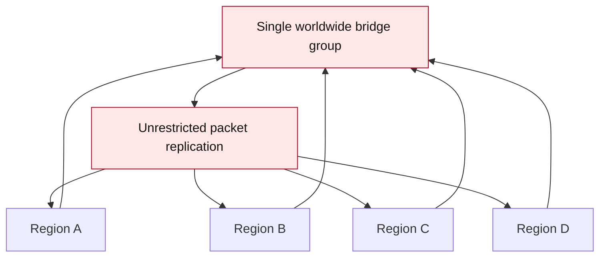

# Controlled TCP bridge/backhaul

## Purpose of the bridge system

MeshCoreNG is RF-first. The bridge system is optional transport/backhaul for specific deployments, not a replacement for RF-local operation.

Bridges are intended for:

- Linking isolated geographic MeshCore RF regions that should intentionally exchange selected traffic.
- Remote RF gateways that need a controlled backhaul path.
- Temporary backhaul during events, tests, or outages.
- Observer, measurement, and research setups.
- Private infrastructure operated by a known group.

Bridges are not intended for:

- A worldwide flooding backbone.
- An always-on global relay.
- Unrestricted packet replication.
- Bypassing normal RF planning and segmentation.

Selected traffic can optionally be transported between isolated MeshCore deployments. Bridge operators decide which bridge server, repeaters, regions, and traffic sources are appropriate for their network.

## Intended usage


The bridge is a controlled link between selected RF islands. Each island should still be designed as a sensible local RF network.

## Not intended



Large-scale uncontrolled forwarding is discouraged. It wastes RF airtime, makes loops harder to reason about, and works against MeshCoreNG's goal of keeping busy radio networks calm.

## RF locality remains important

RF airtime efficiency remains a primary MeshCoreNG design goal. Internet transport should not be used to bypass sensible RF segmentation.

Operators should bridge only what is needed for the deployment. Keep local traffic local where possible, use regional segmentation, and avoid forwarding traffic into RF areas that do not need it.

## Best practices

- Bridge only required channels, topics, or traffic sources.
- Avoid unnecessary rebroadcast into RF networks.
- Use regional segmentation for large deployments.
- Use private bridge groups or private bridge servers when possible.
- Avoid full-network flooding across bridge links.
- Monitor airtime, duplicate counters, and congestion after enabling a bridge.
- Treat every bridge as an operated network service with an owner and a purpose.

## Loop and duplicate protections

Multi-bridge environments need additional safeguards because the same packet may be able to return through a different bridge path.

Implemented protections include:

- TCP bridge v2 envelope metadata with per-bridge origin ID and TTL.
- Duplicate suppression before bridge export and bridge-to-RF injection.
- Export filters and RF hop-count limits for traffic crossing the bridge.
- RF injection controls, including local-only injection and optional budget limits.
- Node and path quarantine commands for runtime blocking through the bridge server management flow.

Still planned or under consideration:

- Path fingerprints.
- Additional lightweight path hashes.
- Richer bridge scoping.

These mechanisms are intended to make controlled bridge deployments safer. They do not change the basic guidance: avoid uncontrolled forwarding, keep bridge groups scoped, and preserve RF locality.

## Bridge firmware types

MeshCoreNG currently has five bridge-oriented paths:

| Build type | Transport | Typical use |
|---|---|---|
| `_bridge_tcp` | ESP32 WiFi TCP client | A WiFi-capable repeater connects directly to a controlled bridge server. |
| `_bridge_tcp_ble` | ESP32 WiFi TCP client + BLE UART bridge | Selected 8MB/16MB ESP32 WiFi+BLE repeaters can run TCP and BLE bridge transports in one firmware. |
| `_bridge_rs232` | Serial/UART bridge | Boards without WiFi use a PC/Raspberry Pi host script or a direct wired UART link to another repeater. |
| `_bridge_espnow` | ESP-NOW | Local ESP32 bridge experiments where WiFi infrastructure is not the main transport. |
| `_bridge_ble` | BLE UART bridge | nRF52 and ESP32 BLE repeaters can form a short-range bridge without WiFi, USB, or extra UART wiring. |

Use `get bridge.type` on the device to confirm which bridge mode is compiled in.

For BLE, flash the same `_bridge_ble` firmware on both BLE-capable repeaters. nRF52 variants use Bluefruit and ESP32 variants use the ESP32 BLE stack. The firmware advertises and scans at the same time, so either repeater can initiate the BLE link. Use the same `bridge.secret` on both sides when you want to keep a bridge pair separate from other BLE bridges in range. Combined `_bridge_tcp_ble` builds are provided for ESP32 boards with enough flash; 4MB ESP32 boards are left as board-by-board test candidates because TCP+BLE can be tight there.

## Path 1: ESP32 repeater with WiFi

Flash a `_bridge_tcp` firmware variant on an ESP32 repeater that has WiFi, then configure it for the selected bridge server:

```text
set wifi.ssid     YourWiFi
set wifi.password secret123
set bridge.server yourserver.example.com
set bridge.port   4200
set bridge.password bridgeSecret
set bridge.enabled on
```

::: tip Upgrading from older firmware
After the large merge from the original MeshCore v1.16.0 firmware, the saved preferences layout may differ from older MeshCoreNG builds. On the first upgrade, WiFi and TCP bridge settings can appear empty or reset to defaults. Re-enter `wifi.ssid`, `wifi.password`, `bridge.server`, `bridge.port`, optionally `bridge.password`, and `bridge.enabled`. Normal later OTA updates with a non-merged `.bin` should preserve those settings.
:::

Check the bridge type:

```text
get bridge.type
```

## Path 2: Repeater via USB or direct UART

Boards without WiFi, including nRF52 (RAK4631), RP2040, STM32, or ESP32 boards without WiFi access, can use a USB-connected PC or Raspberry Pi as the bridge transport host.

Flash the `_bridge_rs232` firmware variant and enable the bridge:

```text
set bridge.enabled on
```

Then run the relay script on the connected computer:

```bash
pip install pyserial
python3 tools/usb_bridge_client.py --serial /dev/ttyUSB0 --baud 115200 \
                                    --server yourserver.example.com --port 4200 \
                                    --bridge-password bridgeSecret
```

On Windows use `--serial COM3`.

The same `_bridge_rs232` firmware can also be used as a direct wired UART bridge between two repeaters, without WiFi and without a USB host:

```text
Repeater A TX  -> Repeater B RX
Repeater A RX  -> Repeater B TX
Repeater A GND -> Repeater B GND
```

Use 3.3V TTL UART levels. Do not connect true +/-12V RS232 directly to board pins.

For Seeed SenseCAP Solar, the RS232 bridge build uses `Serial1` on `D6`/`D7`:

```text
D6 = TX = GNSS_TX
D7 = RX = GNSS_RX
```

Connect SenseCAP Solar repeaters as `D6/TX -> D7/RX`, `D7/RX -> D6/TX`, and `GND -> GND`. These pins are shared with the GNSS UART, so GNSS/GPS cannot use that UART at the same time.

## Status and health

Bridge builds expose status through CLI commands where the firmware supports them:

```text
get bridge.type
get bridge.status
get node.info
```

TCP bridge builds may also expose a small HTTP status page on the device once WiFi is connected. The Python TCP bridge server has its own operator status page with connected nodes, packet counters, RF duty telemetry, and per-node local neighbor counts from updated firmware. Use these pages as operator views, not as public services.

## Running the server

Start the TCP bridge server on a machine the intended bridge repeaters can reach:

```bash
python3 tools/tcp_bridge_server.py --port 4200
```

To require a bridge password from TCP clients:

```bash
python3 tools/tcp_bridge_server.py --port 4200 --password bridgeSecret
```

The basic bridge server requires Python 3.10+ and has no external dependencies. Optional public-channel decoding needs `cryptography`. WiFi repeaters and USB repeaters can connect to the same controlled bridge server simultaneously.

## Security note

The TCP bridge password is an access check, not transport encryption. Run the server on a trusted network or VPS with firewall rules limiting access. TLS support is planned for a future release.

## FAQ

**Does MeshCoreNG require internet?**  
No. Normal MeshCoreNG remains usable as an RF-only LoRa mesh. Only bridge- or MQTT-capable builds use WiFi/IP transport when explicitly configured.

**Is the bridge enabled by default?**  
No. Bridge support requires a bridge-capable firmware build and `set bridge.enabled on`.

**Is this intended to create a global internet mesh?**  
No. The bridge is for controlled transport between selected deployments, not worldwide packet propagation.

**Can bridges be private?**  
Yes. Private bridge servers and private bridge groups are recommended for many deployments.

**Are anti-loop protections implemented?**
Partly. TCP bridge v2 already uses origin IDs, TTL, duplicate suppression, export filters, hop controls, and RF injection controls. Path fingerprints and richer bridge scoping are still being evaluated.
